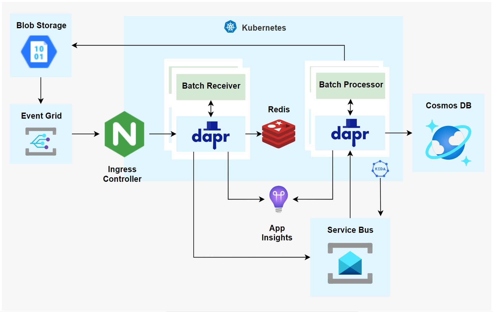

# Dapr - Batch File Processing End to End Sample

This sample demonstrates an end to end sample for processing a batch of related text files using microservices and Dapr. Through this sample you will learn about Dapr's state management, bindings, pub sub, and end to end tracing.

## Scenario

An enterprise receives sales orders from distributors via CSV files, similar to that of many businesses. These files come in batches. Each batch is made up of exactly three different files, each with different information about orders. Here is an example of a batch:

`20180518151300-OrderHeaderDetails.csv`

`20180518151300-OrderLineItems.csv`

`20180518151300-ProductInformation.csv`

Files from the same batch have the same prefix, a date time format. These files can arrive in any order and at different times, so we need wait until all the files for the same batch arrive before processing them. The processing of a batch consists of combine the content of all three these files, converting them from CSV to one JSON per order, and storing each order into a data store.

## Solution

This sample implementation for the batch file processing scenario combines Dapr and Azure. As Dapr is cloud independent it would be possible to reimplement the solution using non-Azure or different Azure components. In this sample Azure services like Service Bus and Cosmos DB, App Insight as a back-end for tracing are used, but other services could be used; for example, instead of using Service Bus as a message broker, Redis Streams or Google Cloud Pub/Sub could be used. The same would apply for state store, output binding to database, and tracing.

Azure Storage receives batches of files (from the batch generator simulator). Each file will trigger an Event Grid notification to a Batch Receiver microservice that uses state management to identify when all files for a batch have arrived. Then Pub Sub is used to trigger a Batch Processor that will transform the batches into individual JSON based orders, and save to Cosmos DB. Dapr's end to end tracing is used to send tracing information to App Insights. Pub Sub is used to provide a layer of load levelling and for scaling the Batch Processor using KEDA, as the processor does the bulk of the processing work.



In this reference implementation the following components are used.

### Components

`Storage` - Azure Blob Storage is where the batches of files will arrive. This sample includes a Batch Generator to simulate distributors sending  batches of files into storage.

`Event Grid` - Event Grid is used to send event notifications of new blobs (each file in the batches) to the ingress controller of Kubernetes (Nginx in this sample).

`Kubernetes/Azure Kubernetes Service (AKS)` - used to orchestrate and host the containers and their Dapr sidecars for the microservices implemented by this sample, as well as Nginx and the Redis instance used by the solution.

`Ngix` - the ingress controller for Kubernetes used in this sample that will receive the notifications from Event Grid about new blobs in storage and route them to the Batch Processor microservice.

`Batch Generator` - a node app microservice that simulates distributors generating CSV files with order information and sends them to `Storage` every 1 min.

`Batch Receiver` - a node app microservice running in Kubernetes that gets called for each CSV file. It has a Dapr sidecar to provide tracing, state management, and pub sub features. It extracts the file prefix as a batch id, then uses that batch id as the key for writing to Dapr's state management, keeping track of what files arrived for each batch. It uses Dapr's state management with `Redis` to get and update the state **(link)**. Once a batch has all 3 files, Batch Receiver will put a message into Dapr pub-sub (batchReceived topic) using `Service Bus` as a message broker.

`Batch Processor` - a node app microservice triggered from Dapr's pub-sub. It has a Dapr sidecar to provide tracing, pub sub, and output binding features. It subscribes to messages from the batchReceived topic and when a message is received, it will fetch all the the three files for a batch from storage, transform them into an array of JSON orders and store each JSON order into `Cosmos DB`. It uses Dapr's Cosmos DB output binding to store the data. This microservice is scaled using `KEDA`.

`KEDA` - [Kubernetes-based Event Driven Autoscaling](https://github.com/kedacore/keda). Used to scale out the Batch Processor based on the number of unprocessed messages in the Service Bus topic used between the microservices for pub-sub.

`Cosmos DB` - the NoSQL data store used by the sample to store the individual orders in JSON format. This would then be used downstream by other solutions in the company.

`App Insights` - Azure App Insights is used for all the end to end tracing created by Dapr for the microservices in the solution.

## Deployment

### Prerequisites

* Docker
* kubectl
* Azure CLI
* Helm3

### Set up Cluster

In this sample we'll be using AKS, but you can install Dapr on any Kubernetes cluster.

Log in to Azure:

```Shell
az login
```

Set the default subscription:

```Shell
az account set -s <subscription-id>
```

Create a resource group:

```Shell
az group create --name <resource-group-name> --location <location> (ex: westus2)
```

Create an Azure Kubernetes Service cluster:

```Shell
az aks create --resource-group <resource-group-name> --name <cluster-name> --node-count 2 --kubernetes-version 1.14.8 --enable-addons http_application_routing --generate-ssh-keys --location westus2
```

References:

* [Deploy AKS using Portal](https://docs.microsoft.com/en-us/azure/aks/kubernetes-walkthrough-portal)
* [Deploy AKS using CLI](https://github.com/dapr/docs/blob/master/getting-started/cluster/setup-aks.md)
* [Dapr Environment - Setup Cluster](https://github.com/dapr/docs/blob/master/getting-started/environment-setup.md#setup-cluster)

### Install Dapr

Install Dapr on the Kubernetes cluster using Helm:

```Shell
helm repo add dapr https://daprio.azurecr.io/helm/v1/repo
helm repo update
kubectl create namespace dapr-system
helm install dapr dapr/dapr --namespace dapr-system
```

References:

* [Dapr Environment Setup](https://github.com/dapr/docs/blob/master/getting-started/environment-setup.md)
* [Install Dapr on a Kubernetes cluster using Helm](https://github.com/dapr/docs/blob/master/getting-started/environment-setup.md#using-helm-advanced)

### Create Blob Storage

1. Create a storage account of kind StorageV2 (general purpose v2) in your Azure Subscription:

    ```Shell
    az storage account create `
        --name <storage-account-name> `
        --resource-group <resource-group-name> `
        --location <location> `
        --sku Standard_RAGRS `
        --kind StorageV2
    ```

2. Create a new blob container in your storage account:

    ```Shell
    az storage container create `
        --name orders `
        --account-name <storage-account-name> `
        --auth-mode login
    ```

3. Generate a shared access signature for the storage account:

    ```Shell
    az storage account generate-sas `
        --account-name <storage-account-name> `
        --expiry <YYYY-MM-DD> `
        --https-only `
        --permissions rwdlacup `
        --resource-types c `
        --services b
    ```

4. Copy one of the storage account access key values:

    ```Shell
    az storage account keys list --account-name <storage-account-name>
    ```

5. Replace <container_base_url> in [batchProcessor\config.json](batchProcessor\config.json) with `https://<storage-account-name>.blob.core.windows.net/orders/`.

6. Replace <storage_sas_token> in [batchProcessor\config.json](batchProcessor\config.json) with the SAS token that you generated earlier.

7. Update [batchReceiver\config.json](batchReceiver\config.json) with your storage account name, resource group name and Azure subscription ID.

8. Replace <storage_account_name> and <storage_account_access_key> in [deploy\blob-storage.yaml](deploy\blob-storage.yaml) with your storage account name and the access key value you copied earlier.

References:

* [Create a container in Azure Storage - Portal](https://docs.microsoft.com/en-us/azure/storage/blobs/storage-quickstart-blobs-portal)
* [Manage Azure Storage resources - CLI](https://docs.microsoft.com/en-us/cli/azure/storage?view=azure-cli-latest)

### Create an ingress controller with a static public IP

Run [this script](scripts\deploy_NGINX.ps1) to deploy the NGINX ingress controller and map a DNS name to the public IP or follow these steps:

1. Initialize variables:

    ```Shell
    $resourceGroup = "<resource-group-name>"
    $clusterName = "<aks-name>"

    # Choose a name for your public IP address which we will use in the next steps
    $publicIpName = "<public-ip-name>"

    # Choose a DNS name which we will create and link to the public IP address in the next steps. Your fully qualified domain name will be: <dns-label>.<location>.cloudapp.azure.com
    $dnsName = "<dns-label>"
    ```

2. Get cluster resource group name:

    ```Shell
    $clusterResourceGroupName = az aks show --resource-group $resourceGroup --name $clusterName --query nodeResourceGroup -o tsv
    Write-Host "Cluster Resource Group Name:" $clusterResourceGroupName
    ```

3. Create a public IP address with the static allocation method in the AKS cluster resource group obtained in the previous steps:

    ```Shell
    $ip = az network public-ip create --resource-group $clusterResourceGroupName --name $publicIpName --sku Standard --allocation-method static --query publicIp.ipAddress -o tsv
    Write-Host "IP:" $ip
    ```

4. Create a namespace for your ingress resources:

    ```Shell
    kubectl create namespace ingress-basic
    ```

5. Use Helm to deploy an NGINX ingress controller:

    ```Shell
    helm repo update

    helm install nginx-ingress stable/nginx-ingress `
        --namespace ingress-basic `
        --set controller.replicaCount=2 `
        --set controller.nodeSelector."beta\.kubernetes\.io/os"=linux `
        --set defaultBackend.nodeSelector."beta\.kubernetes\.io/os"=linux `
        --set controller.service.loadBalancerIP=$ip `
    ```

6. Map a DNS name to the public IP:

    ```Shell
    Write-Host "Setting fully qualified domain name (FQDN)..."
    $publicIpId = az resource list --name $publicIpName --query [0].id -o tsv
    az network public-ip update --ids $publicIpId --dns-name $dnsName

    Write-Host "FQDN:"
    az network public-ip list --resource-group $clusterResourceGroupName --query "[?name=='$publicIpName'].[dnsSettings.fqdn]" -o tsv
    ```

7. Copy the domain name, we will need it in the next step.

It may take a few minutes for the LoadBalancer IP to be available.
You can watch the status by running:

```Shell
kubectl get service -l app=nginx-ingress --namespace ingress-basic -w
```

Now you should get "default backend - 404" when sending a request to either IP or Domain name.

References:
[Create an ingress controller with a static public IP](https://docs.microsoft.com/en-us/azure/aks/ingress-static-ip)

### Configure certificates for HTTPS

Event Grid Web Hook which we'll be configuring later has to be HTTPS and self-signed certificates are not supported, it needs to be from a certificate authority. We will be using the cert-manager project to automatically generate and configure Let's Encrypt certificates.

1. Install the CustomResourceDefinition resources:

    ```Shell
    kubectl apply --validate=false -f https://raw.githubusercontent.com/jetstack/cert-manager/release-0.13/deploy/manifests/00-crds.yaml
    ```

2. Label the cert-manager namespace to disable resource validation:

    ```Shell
    kubectl label namespace ingress-basic cert-manager.io/disable-validation=true
    ```

3. Add the Jetstack Helm repository:

    ```Shell
    helm repo add jetstack https://charts.jetstack.io
    ```

4. Install the cert-manager Helm chart:

    ```Shell
    helm repo update

    helm install `
    cert-manager `
    --namespace ingress-basic `
    --version v0.13.0 `
    jetstack/cert-manager
    ```

5. Verify the installation:

    ```Shell
    kubectl get pods --namespace ingress-basic
    ```

    You should see the cert-manager, cert-manager-cainjector, and cert-manager-webhook pod in a Running state. It may take a minute or so for the TLS assets required for the webhook to function to be provisioned. This may cause the webhook to take a while longer to start for the first time than other pods `https://cert-manager.io/docs/installation/kubernetes/`.

6. Set your email in [deploy\cluster-issuer.yaml](deploy\cluster-issuer.yaml) and run:

    ```Shell
    kubectl apply -f .\deploy\cluster-issuer.yaml --namespace ingress-basic
    ```

7. Set your FQDN in [deploy\ingress.yaml](deploy\ingress.yaml) and run:

    ```Shell
    kubectl apply -f .\deploy\ingress.yaml  --namespace ingress-basic
    ```

    Cert-manager has likely automatically created a certificate object for you using ingress-shim, which is automatically deployed with cert-manager since v0.2.2. If not, follow [this tutorial](https://docs.microsoft.com/en-us/azure/aks/ingress-static-ip#create-a-certificate-object) to create a certificate object.

8. To test, run:

    ```Shell
    kubectl describe certificate tls-secret --namespace ingress-basic
    ```

References:
[Configure certificates for HTTPS](https://docs.microsoft.com/en-us/azure/aks/ingress-static-ip#install-cert-manager)

### Create Cosmos DB resources

Create an Azure Cosmos DB account, database and container in the [Azure Portal](https://docs.microsoft.com/en-us/azure/cosmos-db/create-cosmosdb-resources-portal) or using [CLI](https://docs.microsoft.com/en-us/cli/azure/cosmosdb?view=azure-cli-latest).

1. Initialize variables:

    ```Shell
    $resourceGroupName = "<resource-group-name>"
    $dbAccountName = "<db-account-name>"
    $dbName = "IcecreamDB"
    $containerName = "Orders"
    ```

2. Create an Azure Cosmos DB database account:

    ```Shell
    az cosmosdb create --name $dbAccountName --resource-group $resourceGroupName
    ```

3. Create a database:

    ```Shell
    az cosmosdb sql database create --account-name $dbAccountName --resource-group $resourceGroupName --name $dbName
    ```

4. Create Orders container:

    ```Shell
    az cosmosdb sql container create `
        --account-name $dbAccountName `
        --database-name $dbName `
        --name $containerName `
        --partition-key-path "/id" `
        --resource-group $resourceGroupName
    ```

5. Copy AccountEndpoint and AccountKey from the output:

    ```Shell
    az cosmosdb keys list -g $resourceGroupName --name $dbAccountName --type connection-strings
    ```

6. Update the yaml file with DB account endpoint, DB key, database and container name [deploy\cosmosdb-orders.yaml](deploy\cosmosdb-orders.yaml).

### Redis

1. Install Redis in your cluster:

    ```Shell
    helm repo add bitnami https://charts.bitnami.com/bitnami
    helm install redis bitnami/redis
    ```

2. Get Redis password (Windows) (see the References section on how to get your password for Linux/MacOS).

    ```Shell
    kubectl get secret --namespace default redis -o jsonpath="{.data.redis-password}" > encoded.b64
    certutil -decode encoded.b64 password.txt
    ```

    Copy the password from password.txt and delete the two files: password.txt and encoded.b64.

3. Set Redis password in [deploy\statestore.yaml](deploy\statestore.yaml).

References:

* [Setup Redis](https://github.com/RicardoNiepel/dapr-docs/blob/master/howto/setup-state-store/setup-redis.md)
* [Setup other state stores](https://github.com/dapr/docs/tree/master/howto/setup-state-store)

### Service Bus

1. Initialize variables. Service Bus namespace name should follow [these rules](https://docs.microsoft.com/en-us/rest/api/servicebus/create-namespace):

    ```Shell
    $resourceGroupName = "<resource-group-name>"
    $namespaceName = "<service-bus-namespace-name>"
    ```

2. Create Service Bus namespace:

    ```Shell
    az servicebus namespace create `
        --name $namespaceName `
        --resource-group $resourceGroupName `
        --location westus `
        --sku Standard
    ```

3. Create topic:

    ```Shell
    az servicebus topic create --name batchreceived `
                            --namespace-name $namespaceName `
                            --resource-group $resourceGroupName
    ```

4. Get the connection string for the namespace:

    ```Shell
    $connectionString=$(az servicebus namespace authorization-rule keys list --resource-group $resourceGroupName --namespace-name $namespaceName --name RootManageSharedAccessKey --query primaryConnectionString --output tsv)
    Write-Host "Connection String:", $connectionString
    ```

5. Replace <namespace_connection_string> in [deploy\messagebus.yaml](deploy\messagebus.yaml) with your connection string.

References:

* [Create a Service Bus namespace and topic](https://docs.microsoft.com/en-us/azure/service-bus-messaging/service-bus-quickstart-topics-subscriptions-portal)
* [Setup a Dapr pub/sub](https://github.com/dapr/docs/tree/master/howto/setup-pub-sub-message-broker)

### Set up distributed tracing

#### Application Insights

1. Add App Insights extension to Azure CLI:

    ```Shell
    az extension add -n application-insights
    ```

2. Create an App Insights resource:

    ```Shell
    az monitor app-insights component create `
        --app <app-insight-resource-name> `
        --location <location> `
        --resource-group <resource-group-name>
    ```

3. Copy the value of the instrumentationKey, we will need it later

#### LocalForwarder

1. Open the [deployment file](deploy\localforwarder-deployment.yaml) and set the Instrumentation Key value.
2. Deploy the LocalForwarder to your cluster.

   ```Shell
   kubectl apply -f .\deploy\localforwarder-deployment.yaml
   ```

#### Dapr tracing

1. Deploy the dapr tracing configuration:

   ```Shell
   kubectl apply -f .\deploy\dapr-tracing.yaml
   ```

2. Deploy the exporter:

   ```Shell
   kubectl apply -f .\deploy\dapr-tracing-exporter.yaml
   ```

References:
[Create an Application Insights resource](https://docs.microsoft.com/en-us/azure/azure-monitor/app/create-new-resource)

### KEDA

1. Deploy KEDA:

    ```Shell
        helm repo add kedacore https://kedacore.github.io/charts
        helm repo update
        kubectl create namespace keda
        helm install keda kedacore/keda --namespace keda
    ```

2. Initialize variables:

    ```Shell
    $resourceGroupName = "<resource-group-name>"
    $namespaceName = "<service-bus-namespace-name>"
    ```

3. Create Authorization Rule for 'batchreceived' topic:

    ```Shell
    az servicebus topic authorization-rule create --resource-group $resourceGroupName --namespace-name $namespaceName --topic-name batchreceived --name kedarule --rights Send Listen Manage
    ```

4. Get the connection string and create a base64 representation of the connection string.

    ```Shell
    $primaryConnectionString = az servicebus topic authorization-rule keys list --name kedarule --resource-group $resourceGroupName --namespace-name $namespaceName --topic-name batchreceived --query primaryConnectionString --output tsv

    Write-Host "base64 representation of the connection string:"
    [System.Convert]::ToBase64String([System.Text.Encoding]::UTF8.GetBytes($primaryConnectionString))
    ```

5. Replace `<your-base64-encoded-connection-string>` in [deploy\batch-processor-keda.yaml](deploy\batch-processor-keda.yaml) file.

References:

* [Deploy KEDA with Helm](https://keda.sh/docs/1.4/deploy/#helm)
* [Azure Service Bus Scaler](https://keda.sh/docs/1.4/scalers/azure-service-bus/)

### Build and push images to AKS

1. Create an Azure Container Registry (ACR) (Lowercase registry name is recommended to avoid warnings):

    ```Shell
    az acr create --resource-group <resource-group-name> --name <acr-name> --sku Basic
    ```

    Take note of loginServer in the output.

2. Integrate an existing ACR with existing AKS clusters:

    ```Shell
    az aks update -n <cluster-name> -g <resource-group-name> --attach-acr <acr-name>
    ```

3. Change ACR loginServer and name in the following scripts and run them. They will build an image for each microservice and push it to the registry:

    * [scripts\build_generator.ps1](scripts\build_generator.ps1)
    * [scripts\build_receiver.ps1](scripts\build_receiver.ps1)
    * [scripts\build_processor.ps1](scripts\build_processor.ps1)

4. Update the following files with your registry loginServer:

    * [deploy\batch-generator.yaml](deploy\batch-generator.yaml)
    * [deploy\batch-processor-keda.yaml](deploy\batch-processor-keda.yaml)
    * [deploy\batch-receiver.yaml](deploy\batch-receiver.yaml)

References:
[Create a private container registry using the Azure CLI](https://docs.microsoft.com/en-us/azure/container-registry/container-registry-get-started-azure-cli)

### Deploy microservices

1. Deploy Dapr components:

    ```Shell
    kubectl apply -f .\deploy\statestore.yaml
    kubectl apply -f .\deploy\cosmosdb-orders.yaml
    kubectl apply -f .\deploy\messagebus.yaml
    kubectl apply -f .\deploy\blob-storage.yaml
    ```

2. Deploy microservices:

    ```Shell
    kubectl apply -f .\deploy\batch-generator.yaml
    kubectl apply -f .\deploy\batch-receiver.yaml
    kubectl apply -f .\deploy\batch-processor-keda.yaml
    ```

### Subscribe to the Blob Storage

Now we need to subscribe to a topic to tell Event Grid which events we want to track, and where to send the events. batch-receiver microservice should already be running to send back a validation code.

CLI:

```Shell
az eventgrid event-subscription create `
    --source-resource-id "/subscriptions/<subscription-id>/resourceGroups/<resource-group-name>/providers/Microsoft.Storage/storageaccounts/<storage-account-name>" `
    --name blob-created `
    --endpoint-type webhook `
    --endpoint https://<FQDN>/api/blobAddedHandler `
    --included-event-types Microsoft.Storage.BlobCreated
```

Portal:

1. In the portal, navigate to your Azure Storage account that you created earlier.
2. On the Storage account page, select Events on the left menu.
3. Create new Event Subscription:
    1. Enter a name for the event subscription.
    2. Select Blob Created event in the Event Types drop-down.
    3. Select Web Hook for Endpoint type.
    4. Select an endpoint where you want your events to be sent to (`https://<FQDN>/api/blobAddedHandler`).

References:
[Subscribe to the Blob storage](https://docs.microsoft.com/en-us/azure/event-grid/blob-event-quickstart-portal?toc=%2fazure%2fstorage%2fblobs%2ftoc.json#subscribe-to-the-blob-storage)